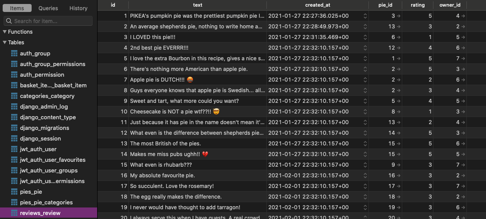

# 🇸🇪 PIEKEA - A Django & React App

A Django, PostgresSQL, React full-stack app. My second pair project for General Assembly's Software Engineering Immersive.

### Developed by:
* Penny Jungreis - [GitHub](https://github.com/penelopecj)

* Edwyn Abi-Acar - [GitHub](https://github.com/Edwyn26)


## Deployment
I deployed this website using Heroku and it is available [_here_](http://piekea.herokuapp.com/). The free servers on Heroku sleep when they are not it use, so please allow a minute or two for them to wake up! 😴

Feel free to register your own account, or you can use mine `penny@email.com` and password `pass`.

## Concept
**PIEKEA** has some similarities to the popular Swedish furniture store, [IKEA](https://www.ikea.com/gb/en/). Both stores include a robust e-commerce platform and the option to build and customise the products. However, while IKEA sells a wide variety of home and outdoor furniture, PIEKEA sells a delicious selection of freshly baked pies to be eaten at home or in the outdoors. A variety of sweet and savoury pies available, while supplies last.

N.B.: There are no actual pies involved.

## Project Brief
* One week to plan, build, and test our final project with a focus on cementing the learning from the past 11 weeks and showing off our new Python skills.
* Choose to work solo, as a pair, or as a group for the duration of the project.
* Review project proposal with our instructor so we can make sure it can be accomplished in the limited time we have.
* Build a full-stack application by making our own backend and front-end.
* Use a Python Django API, using Django REST Framework to serve our data from a Postgres database.
* Consume our API with a separate frontend built with React.
* Build a complete product, which most likely means multiple relationships and CRUD functionality for at least a couple of models.
* Implement thoughtful user stories/wireframes that are significant enough to help us know which features are core MVP and which can be cut.
* Have a visually impressive design and be deployed online so it's publicly accessible.
* A git repository hosted on Github, with a link to your hosted project and frequent commits dating back to the very beginning of the project.

## Technologies Used
* **Database**:
  * PostgresSQL
* **Backend**:
  * Python
  * Django
* **Frontend**:
  * JavaScript (ES6)
  * React.js
  * HTML5
  * CSS3 + SASS
* **Dependencies**:
  * djangorestframework
  * djangorestframework-camel-case
  * pyjwt
  * python-dotenv
  * psycopg2-binary
  * Axios
  * react-router-dom
  * simple-react-lightbox
  * JSONWebToken
  * Semantic UI
* **Development Tools**:
  * VS Code
  * Git + GitHub
  * Insomnia
  * TablePlus
  * Heroku
  * pylint

## Installation Instructions
1. Clone repo code from GitHub onto your machine.
2. Run `pipenv install` in the root directory to install all packages from Pipfile.
3. Run `pipenv shell` in the root directory to spawn a shell within the virtual environment.
4. Use `python manage.py runserver` to start the backend server in the root driectory.
5. Open up a second terminal and `cd client`.
6. Use `yarn` or `npm` in your client directory to install all dependencies from the `package.json` file.
7. Run `yarn start` from client to start the frontend.

## User Stories & Wireframes

**Database Entity Relationship Diagram**


**Wireframe**

## General Approach & Planning
* My partner and I began by mocking up a basic wireframe and plan for the app on a Google Doc (above).
* We next created an entity relationship diagram (ERD) for our database tables and relationships (above).
* We tried not to get caught up in too many awesome features and to keep the project fairly simple. 
* We decided to build an e-commerce site that could handle unlimited user accounts and keeping track of the products in their baskets. That was our core MVP - we only added in additional features once we realised we were running ahead of schedule.
* We focussed on the design first, beginning by planning our user stories and wireframes before writing any code.
* We set up a Trello board for project management and task delegation.


* We followed an Agile system for starting each day with a standup meeting for the two of us, followed by a standup for the group leaders of each group on the course.
* We split up all of our tasks into the first MVP sprint or the second optional extras sprint. We used Trello to track who was working on what and to let each other know when we had finished a task or needed help.
* I used Trello and Slack to write pseudocode to think through the logic and steps of the more complicated features.
* By this point on the General Assembly course, I felt quite confident about my pair-coding, communication, and project management systems. This allowed us to get started writing actual code very quickly on the first day.
* I used Slack and frequent commits to let my partner know what I was working on and what I had pushed to our shared git development branch.


### DAYS 1 & 2
* We started out by scaffolding the backend, adding the PostgresSQL database, writing seeds data, and installing dependencies. All of this went surprisingly smoothly, which showed us we had come a long way from our first projects.
* Using Django, I set up the "apps" for pies, users, reviews, categories, and basket items. These are quite quick to do with Django, so I had time to write the models, urls, and views for all of these.

**Pie Model**
```
class Pie(models.Model):
    name = models.CharField(max_length=50, unique=True)
    description = models.CharField(max_length=500)
    image = models.CharField(max_length=300)
    price = models.FloatField()
    categories = models.ManyToManyField('categories.Category', related_name='pies')

    def __str__(self):
            return f"{self.name} - £{self.price}"
```

* Next I began writing serializers for each app only as needed, and adding additional RESTful routes and serializers as I went along.

```
from jwt_auth.serializers.common import UserSerializer
from pies.serializers.populated import PopulatedPieSerializer
from ..serializers.common import BasketSerializer

class PopulatedBasketSerializer(BasketSerializer):
    owner = UserSerializer()
    product = PopulatedPieSerializer()
```

* I migrated each new app as I made changes and let my partner know to do the same.
* I tested each new RESTful route I added to the models using Insomnia as well as Django's built in admin page.

**POST request on Insomnia**


**Manage pies on Django admin**


* We spent the evenings writing out seeds data, which I then converted to JSON in the mornings and re-seeded into the working backend.
* I also checked that the database was set up and seeded correctly with TablePlus.



* Once all was working, I complicated the relationships as shown in our ERD and added a many-to-many relationship between our users and products, to use later as the 'favourite' feature.
```
favourites = models.ManyToManyField('pies.Pie', related_name='users', blank=True)
```
* I also added a many-to-many relationship between the pies and the categories that we could use later to filter the pies by category and list the descriptor words for each pie product.
```
categories = models.ManyToManyField('categories.Category', related_name='pies')
```
* I then adapted the basket items GET request on the backend that would ensure the user only sees the items in the user's own basket. Similarly, I added a check that will PUT an item the user wants to purchase in that user's own basket.

**Basket Items Views**
```
class BasketListView(APIView):
    """ Controller for get and post request to /basket endpoint """

    permission_classes = (IsAuthenticated, )

    def get(self, _request):
        basket_items = Basket_Item.objects.filter(owner=self.request.user)
        serialized_items = PopulatedBasketSerializer(basket_items, many=True)
        return Response(serialized_items.data, status=status.HTTP_200_OK)

    def post(self, request):
        request.data["owner"] = request.user.id
        basket = BasketSerializer(data=request.data)
        if basket.is_valid():
            basket.save()
            return Response(basket.data, status=status.HTTP_201_CREATED)
        return Response(basket.errors, status=status.HTTP_422_UNPROCESSABLE_ENTITY)

class BasketDetailView(APIView):
    """ Controller for delete and edit requests to /basket_item/id(pk) endpoint """

    permission_classes = (IsAuthenticated, )

    def delete(self, request, pk):
        try:
            basket_to_delete = Basket_Item.objects.get(pk=pk)
            if basket_to_delete.owner.id != request.user.id:
                raise PermissionDenied()
            basket_to_delete.delete()
            return Response(status=status.HTTP_204_NO_CONTENT)
        except Basket_Item.DoesNotExist:
            raise NotFound()

    def put(self, request, pk):
        basket_to_update = Basket_Item.objects.get(pk=pk)
        if basket_to_update.owner.id != request.user.id:
            print(basket_to_update.owner.id)
            print(request.user.id)
            raise PermissionDenied()
        updated_basket = BasketQuantitySerializer(basket_to_update, data=request.data)
        if updated_basket.is_valid():
            updated_basket.save()
            return Response(updated_basket.data, status=status.HTTP_202_ACCEPTED)
        return Response(updated_basket.errors, status=status.HTTP_422_UNPROCESSABLE_ENTITY)
```

* We wrote out and tested our error handling for all of the basic RESTful routes and finished building our backend after just _two_ days. Thank you, Django!


## DAYS 3 & 4
* We were running ahead of schedule, so we took some time to re-evaluate our MVP and add in additional features from our wish list to the current sprint.


* My partner preferred to style using Semantic UI and I preferred to style using SASS, so we installed both on our project to use.


## Days 5 & 6
* I thought it would be more difficult, but this was incredibly easy to add with JavaScript.

**Array method in the JSX to show the total cost of the items in the basket, accounting for quantities**
```
<p className="total">£{basketItems.reduce((acc, curr) => {
  return acc + (curr.product.price * curr.quantity)
}, 0).toFixed(2)}
</p>
```


* **Read the docs for whatever technologies / frameworks / API's you use**.
* **Write your code DRY** and **build your APIs RESTful**.
* **Be consistent with your code style.** You're working in teams, but you're only making one app per team. Make sure it looks like a unified effort.
* **Commit early, commit often.** Don't be afraid to break something because you can always go back in time to a previous version.
* **Keep user stories small and well-defined**, and remember – user stories focus on what a user needs, not what development tasks need accomplishing.
* **Write code another developer wouldn't have to ask you about**. Do your naming conventions make sense? Would another developer be able to look at your app and understand what everything is?
* **Make it all well-formatted.** Are you indenting, consistently? Can we find the start and end of every div, curly brace, etc?
* **Comment your code.** Will someone understand what is going on in each block or function? Even if it's obvious, explaining the what & why means someone else can pick it up and get it.

