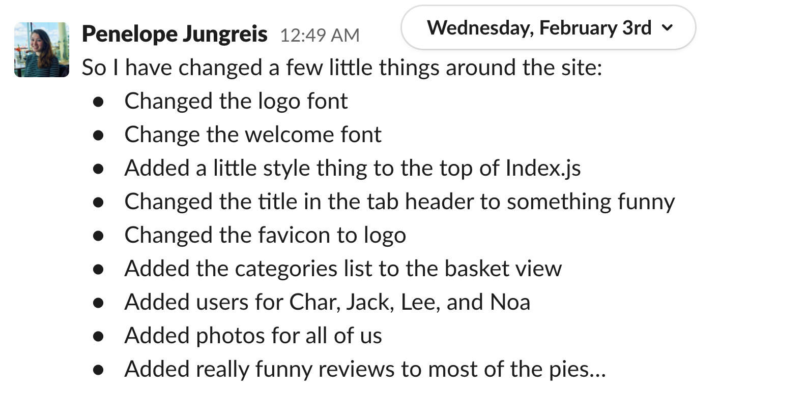

# 🇸🇪 PIEKEA - A Django & React App

A Django, PostgresSQL, React full-stack app. My final project for General Assembly's Software Engineering Immersive.

### Developed by:
* Penny Jungreis - [GitHub](https://github.com/penelopecj)

* Edwyn Abi-Acar - [GitHub](https://github.com/Edwyn26)


## Deployment
I deployed this website using Heroku and it is available [_here_](http://piekea.herokuapp.com/). The free servers on Heroku sleep when they are not it use, so please allow a minute or two for them to wake up! 😴

Feel free to register your own account, or you can use mine `penny@email.com` and password `pass`.

## Concept
**PIEKEA** has some similarities to the popular Swedish furniture store, [IKEA](https://www.ikea.com/gb/en/). Both stores include a robust e-commerce platform and the option to build and customise the products. However, while IKEA sells a wide variety of home and outdoor furniture, PIEKEA sells a delicious selection of freshly baked pies to be eaten at home or in the outdoors. A variety of sweet and savoury pies available, while supplies last.

N.B.: The pies are not actually for sale.

## Project Brief
* One week to plan, build, and test our final project with a focus on cementing the learning from the past 11 weeks and showing off our new Python skills.
* Choose to work solo, as a pair, or as a group for the duration of the project.
* Review project proposal with our instructor so we can make sure it can be accomplished in the limited time we have.
* Build a full-stack application by making our own backend and front-end.
* Use a Python Django API, using Django REST Framework to serve our data from a PostgresSQL database.
* Consume our API with a separate frontend built with React.
* Build a complete product, which most likely means multiple relationships and CRUD functionality for at least a couple of models.
* Implement thoughtful user stories/wireframes that are significant enough to help us know which features are core MVP and which can be cut.
* Have a visually impressive design and be deployed online so it's publicly accessible.
* A git repository hosted on Github, with a link to your hosted project and frequent commits dating back to the very beginning of the project.

## Technologies Used
* **Database**:
  * PostgresSQL
* **Backend**:
  * Python
  * Django
* **Frontend**:
  * JavaScript (ES6)
  * React.js
  * HTML5
  * CSS3 + SASS
  * Semantic UI
* **Dependencies**:
  * djangorestframework
  * djangorestframework-camel-case
  * pyjwt
  * python-dotenv
  * psycopg2-binary
  * Axios
  * react-router-dom
  * simple-react-lightbox
  * JSONWebToken
* **Development Tools**:
  * VS Code
  * Git + GitHub
  * Insomnia
  * TablePlus
  * Heroku
  * pylint

## Installation Instructions
1. Clone repo code from GitHub onto your machine.
2. Run `pipenv install` in the root directory to install all packages from Pipfile.
3. Run `pipenv shell` in the root directory to spawn a shell within the virtual environment.
4. Use `python manage.py runserver` to start the backend server in the root driectory.
5. Open a second terminal and `cd client`.
6. Use `yarn` or `npm` in your client directory to install all dependencies from the `package.json` file.
7. Run `yarn start` from client to start the frontend.

## User Stories & Wireframes

**Database Entity Relationship Diagram**


**Wireframe & User Story**


## General Approach & Planning
* My partner and I began by mocking up a basic wireframe and plan for the app on a Google Doc (above).
* We next created an entity relationship diagram (ERD) for our database tables and relationships (above).
* We decided to build an e-commerce site that could handle unlimited user accounts and keeping track of the products in their baskets. That was our core MVP - we only added in additional features once we realised we were running ahead of schedule.
* We set up a Trello board for project management and task delegation.


* We followed an Agile system for starting each day with a standup for the two of us, followed by a standup for the group leaders of each group on the course.
* We split up all of our tasks into the first MVP sprint or the second optional extras sprint. We used Trello to track who was working on what and to let each other know when we had finished a task or needed help.
* I used Trello and Slack to write pseudocode to think through the logic and steps of the more complicated features.
* By this point in the course, I felt quite confident about my pair-coding, communication, and project management systems. This allowed us to get started writing actual code very quickly on the first day.
* I used Slack and frequent commits to let my partner know what I was working on and what I had pushed to our shared git development branch.


## Days 1 & 2
* We started out by scaffolding the backend, adding the PostgresSQL database, writing seeds data, and installing dependencies. All of this went surprisingly smoothly, which showed us we had come a long way from our first projects.
* Using Django, I set up the "apps" for pies, users, reviews, categories, and basket items. These are quite quick to do with Django, so I had time to write the models, urls, and views for all of these.

**Pie Model**
```
class Pie(models.Model):
    name = models.CharField(max_length=50, unique=True)
    description = models.CharField(max_length=500)
    image = models.CharField(max_length=300)
    price = models.FloatField()
    categories = models.ManyToManyField('categories.Category', related_name='pies')

    def __str__(self):
            return f"{self.name} - £{self.price}"
```

* Next I began writing serializers for each app only as needed, and adding additional RESTful routes and serializers as I went along.

```
from jwt_auth.serializers.common import UserSerializer
from pies.serializers.populated import PopulatedPieSerializer
from ..serializers.common import BasketSerializer

class PopulatedBasketSerializer(BasketSerializer):
    owner = UserSerializer()
    product = PopulatedPieSerializer()
```

* I migrated each new app as I made changes and let my partner know to do the same.
* I tested each new RESTful route I added to the models using Insomnia as well as Django's built-in admin page.

**POST request on Insomnia**


**Manage pies on Django admin**


* We spent the evenings writing out seeds data, which I then converted to JSON in the mornings and re-seeded into the working backend.
* I also checked that the database was set up and seeded correctly with TablePlus.


* Once all was working, I complicated the relationships as shown in our ERD and added a many-to-many relationship between our users and products, to use later as the 'favourite' feature.
```
favourites = models.ManyToManyField('pies.Pie', related_name='users', blank=True)
```
* I also added a many-to-many relationship between the pies and the categories that we could use later to filter the pies by category and list the descriptor words for each pie product.
```
categories = models.ManyToManyField('categories.Category', related_name='pies')
```
* I then adapted the basket items GET request on the backend that would ensure the user only sees the items in the user's own basket. Similarly, I added a check that will PUT an item the user wants to purchase in that user's own basket.

**Basket Items Views**
```
class BasketListView(APIView):
    """ Controller for get and post request to /basket endpoint """

    permission_classes = (IsAuthenticated, )

    def get(self, _request):
        basket_items = Basket_Item.objects.filter(owner=self.request.user)
        serialized_items = PopulatedBasketSerializer(basket_items, many=True)
        return Response(serialized_items.data, status=status.HTTP_200_OK)

    def post(self, request):
        request.data["owner"] = request.user.id
        basket = BasketSerializer(data=request.data)
        if basket.is_valid():
            basket.save()
            return Response(basket.data, status=status.HTTP_201_CREATED)
        return Response(basket.errors, status=status.HTTP_422_UNPROCESSABLE_ENTITY)

class BasketDetailView(APIView):
    """ Controller for delete and edit requests to /basket_item/id(pk) endpoint """

    permission_classes = (IsAuthenticated, )

    def delete(self, request, pk):
        try:
            basket_to_delete = Basket_Item.objects.get(pk=pk)
            if basket_to_delete.owner.id != request.user.id:
                raise PermissionDenied()
            basket_to_delete.delete()
            return Response(status=status.HTTP_204_NO_CONTENT)
        except Basket_Item.DoesNotExist:
            raise NotFound()

    def put(self, request, pk):
        basket_to_update = Basket_Item.objects.get(pk=pk)
        if basket_to_update.owner.id != request.user.id:
            print(basket_to_update.owner.id)
            print(request.user.id)
            raise PermissionDenied()
        updated_basket = BasketQuantitySerializer(basket_to_update, data=request.data)
        if updated_basket.is_valid():
            updated_basket.save()
            return Response(updated_basket.data, status=status.HTTP_202_ACCEPTED)
        return Response(updated_basket.errors, status=status.HTTP_422_UNPROCESSABLE_ENTITY)
```

* We wrote out and tested our error handling for all of the basic RESTful routes and finished building our backend after just _two_ days. Thank you, Django!


## Days 3 & 4
* We were running ahead of schedule, so we took some time to re-evaluate our MVP and add in additional features from our wish list to the current sprint.
* We added a React front end to our project and divided up the router and component setup.
* My partner preferred to style using Semantic UI and I preferred to style using SASS, so we installed both on our project to use.
* We opted to use Axios for REST front end side as it makes it easier to edit and delete items from the database.
* I built the nav bar with flexbox and Material Icons.


* I wrote GET requests to display the basic info about the pies on a "show all" index page.


* And a separate request and page to display more detail about indivdual products on the show page if you click on one.


* And an Axios POST function to create a new pie with the customise feature.

```
export function getAllPies() {
  return axios.get(`${baseUrl}/pies/`)
}

export function createPie(formdata) {
  return axios.post(`${baseUrl}/pies/`, formdata, headers())
}

export function getSinglePie(id) {
  return axios.get(`${baseUrl}/pies/${id}/`)
}
```

* Next, I built a **♡** button and separate wish list component. This required going back to the backend to write a special serializer for the users that would only require the `favourites: []` array to get updated on a given user object in the database.

```
class FavouritesUserSerializer(serializers.ModelSerializer):
    class Meta:
        model = User
        fields = ("favourites", )
```


**Function for ♡ Button**
```
const handleAddToWishlist = async () => {
  const favIds = user.favourites.map(fav => {
    return fav.id
  })
  await editUser(payload.sub, { favourites: [ ...favIds, pie.id ] })
}
```

**JSX Code for Wish List**
```
{user.favourites.map(fav => {
  return (
    <li key={fav.id} className="box">
      <Link to={`pies/${fav.id}`} className="flex-box space-between">
        <figure>
          
        </figure>
        <div>
          <h3>{fav.name}</h3>
          <h4>£{fav.price.toFixed(2)}</h4>
          <p>{fav.description}</p>
        </div>
      </Link>
    </li>
  )
})}
```

## Days 5 & 6
* I preferred to style as I went along to ensure we would not run out of time for CSS at the end of the week. Especially for a clone site, I wanted to make sure it looked a lot like IKEA.


* I was very happy with how my styling for the basket page turned out, much like the IKEA basket.

**PIEKEA Basket (COPY)**


**IKEA Basket (ORIGINAL)**


* I used simple CSS and Google fonts to make text that looked like the IKEA logo.


* I added a simple function to the pie product page to add to basket, which imports a function to use `axios.post`.
```
const handleAddToBasket = async () => {
  try {
    await createBasketItem({
      quantity: 1,
      product: id
    })
    history.push('/basket')
  } catch (err) {
    console.log(err)
  }
}
```

* I added a function to delete a pie from the basket, which imports a function to use `axios.delete`.
```
const handleRemoveFromBasket = async (event) => {
  try {
    await deleteBasketItem(event.target.id)
    const { data } = await getAllBasketItems()
    setBasketItems(data) 
  } catch (err) {
    console.log(err)
  }
}
```

* I built a display for the reviews with photos, names, timestamp, and star rating. If a user does not have a profile photo, it will display an anonymous photo as a placeholder. Only the user who left the review can delete the review.


## Final Day



* We had just enough time at the end of the week to add some IKEA-esque fonts to the site and include söme Swedish letters in the heåders and seeds däta (in homage to IKEA's hömelånd).
* I suddenly realised we didn't have a **Logout** button 30 minutes before the presentation and built one very quickly right before we presented our project. What a rush!


## Wins
* My partner and I worked hard to get only the quantity of one pie basket item to update using a number input in a mapped JSX element.
```
{basketItems.map((item, index) => {
  return (
    <div className="flex-box basket-item" key={item.id}>
      <figure>
        
      </figure>
      <div>
        <h3>{item.product.name}</h3>
        <p><strong>£{item.product.price.toFixed(2)}</strong></p>
        {item.product.categories.length > 0 ?
          <ul>
            {item.product.categories.map(category => {
              return (
                <li key={category.id}>{category.name}</li>
              )
            })}
          </ul>
          :
          <ul></ul>
        }
        <div className="change-quantity">
          <p>Quantity: </p>
          <input 
            placeholder={item.quantity}
            onChange={handleChange} 
            id={index} 
            name="quantity" 
            type="number" 
            max="15"
            min="1"
            value={formdata.quantity} 
          />
          <button 
            onClick={handleEditFromBasket} 
            id={item.id} 
            className={index} 
          >Update item</button>
        </div>
        <p onClick={handleRemoveFromBasket} id={item.id} className="remove-add-btn">Remove</p>
        <p onClick={handleAddToWishlist} id={item.product.id}className="remove-add-btn">Add to your wish list</p>
      </div>
    </div>
  )
})
}
```

* We updated the numbers in state first.
```
function useEditQuantityForm(initialState) {
  const [formdata, setFormdata] = React.useState(initialState)
  const [errors, setErrors] = React.useState(initialState)

  const handleChange = event => {
    const value = event.target.type === 'checkbox' ? event.target.checked : event.target.value

    const editingArray = [...formdata]
    editingArray[event.target.id].quantity = value

    const nextErrorState = { ...errors, [event.target.name]: '' }

    setFormdata(editingArray)
    setErrors(nextErrorState)
  }
```

Then sent the PUT request to the database when the user clicks on "**Update item**".

```
const handleEditFromBasket = async (event) => {
  try {
    await updateBasketItem(event.target.id, formdata[parseInt(event.target.className)]) 
    const { data } = await getAllBasketItems()
    setBasketItems(data)
  } catch (err) {
    console.log(err)
  }
}
```
* I added an array method in the JSX to show the total cost of the items in the basket, accounting for quantities. I thought it would be more difficult, but this was incredibly easy to add with JavaScript.

```
<p className="total">£{basketItems.reduce((acc, curr) => {
  return acc + (curr.product.price * curr.quantity)
}, 0).toFixed(2)}
</p>
```

* I used a custom React hook to handle the form state manipulation and checkboxes on the customise pie form. Used an object spread to create a new object every time, triggering the React state to change and the browser to re-render.

```
function useCheckboxForm(initialState) {
  const [formdata, setFormdata] = React.useState(initialState)
  const [errors, setErrors] = React.useState(initialState)

  const handleChange = event => {
    const value = event.target.type === 'checkbox' ? JSON.parse(event.target.value) : event.target.value

    const nextState = { ...formdata, categories: [...formdata.categories, value] }
    const nextErrorState = { ...errors, [event.target.name]: '' }
    
    setFormdata(nextState)
    setErrors(nextErrorState)
  }

  return {
    formdata,
    setFormdata,
    errors,
    handleChange,
    setErrors
  }
}
export default useCheckboxForm
```

* This feature was inspired by the Domino's custom pizza builder in style and functionality. It was very tricky to manage the checkboxes UI and JSX, even with using the custom hook I wrote above.

I had to make sure that all of the datatypes were converted correctly from objects to arrays, to states, back to arrays, to strings, to numbers, etc...
```
categories.map(category => {
  return (
    <div key={category.id}>
      <label>{category.name} </label>
      <input 
        type="checkbox" 
        onChange={handleChange} 
        value={JSON.stringify(category)}
        checked={formdataCategories.some(object => object.name === category.name)}
      />
    </div>
  
  )
})
```


___


* This was probably the most satisfying piece of code to write in the whole project after spending so much time wrangling the data to get manipulated by this form. I realised I had complete control over the the object that was added to the pies and baskets database and could change whatever I wanted at will!

```
const handleSubmit = async (event) => {
  event.preventDefault()
  const unPopulatedCategories = formdata.categories.map(object => {
    return object.id
  })
  try {
    const { data } = await createPie({ ...formdata, name: `Custom ${formdata.name}`, price: `${formdata.price + 10}`, reviews: [], categories: unPopulatedCategories, image: 'https://farm9.staticflickr.com/8333/8391597635_2af90bd702.jpg' })
    handleAddToBasket(data)
  } catch (err) {
    setErrors(err.response.data.errors)
  }
}
```


## Challenges Overcome
* We had some trouble figuring out how to store hashed passwords in our seeds data so we could create multiple users on seeding. We figured out we could create one user manually, dump the data into a seeds file, and then copy that hashed password for all users to start with.

```
"password": "pbkdf2_sha256$216000$RVlWaEcAABtL$UGP+lwcmVDE27T/XVnPCDFRG75CYIYGladDEvIvZxG0=",
"last_login": null,
"is_superuser": false,
"username": "charlotte",
"is_staff": false,
"is_active": true,
"date_joined": "2021-01-28T14:40:05.574Z",
"email": "charlotte@email.com",
```


* We would often run into errors in the evening when we were working seperately on different features, but Slack was a huge help for communication and keeping track of errors for the next morning.


## Key Learnings
For the category filters on the `Index.js` page, we initially tried to adapt code from another project my partner had worked on. However, this consumed a lot of time, and because we had set up our data and datatypes differently to the other project, this tactic proved to be more time spent than saved. The old code can be viewed in `PieCategories.js`. I ended up starting from scratch to use a much simpler filter function on the `pies` state that stored all of the pies data from a GET request.
```
const handleFilterPies = (event) => {
  const results = pies.filter(pie => {
    return pie.categories.includes(parseInt(event.target.id))
  })
  setPies(results)
}
```
And to clear the filters and display all pies again:
```
const handleClearFilter = async () => {
  const { data } = await getAllPies()
  setPies(data)
}
```
The takeaway for me was that it only makes sense to adapt existing code if it is similar enough to not need to write much. In this case, I spent much more time trying to untangle the old code than I eventually spent writing the new code.


## Unsolved Problems
* We didn't have enough time to get the sliding nav bar working in `SideBar.js`.
* `PieCategories.js` never made it onto the final website because we could not convert the existing code into the format we needed.

## Features Wish List
* Users can _un_-check categories on the custom pie builder and remove them from the categories array, instead of just adding more.
* Users can delete pies if they are the creator.
* UI styling to show which categories are selected of the filters on `Index.js`.
* A search bar to check for full or partial product matches on `Index.js`.
* Responsive design for smaller screens.
* Use Cloudinary or other third party service to handle profile photo uploads.
* Designate "seller" users who can own and add new pies for sale.
* Display the average rating for each product.
* Like button for reviews.
* Display top-voted pies and reviews on homepage.

✨ ***PRs welcome!*** ✨
## Credits

All icons from [Material Design](https://material.io/resources/icons/).

All fonts provided by [Google Fonts](https://fonts.google.com/).

Some styles from [Semantic UI](https://semantic-ui.com/).

Website inspired by [IKEA](https://www.ikea.com/gb/en/).